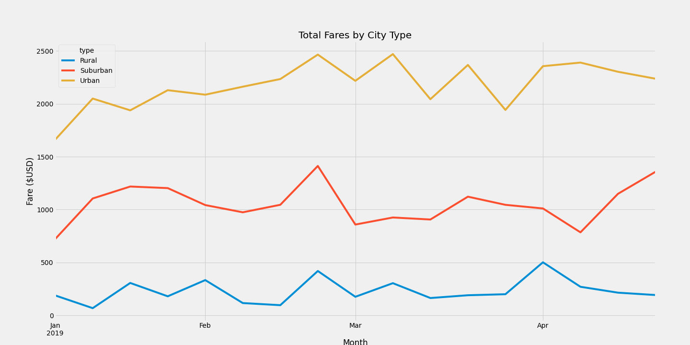
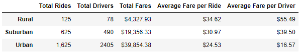

# PyBer_Analysis
## Overview
The purpose of this analysis was to aggregate the city data and ride date in various forms of visual representation of data to uncover trends in ridership with respect to types of urban environments and total fares.

## Results
Base on the results from the analysis of the data, there was a difference in ride-sharing data between the three city types; urban, suburban, and rural. The data shows that urban cities have the highest total fares from the given time period of January 1, 2019 to April 29, 2019 as illustrated by the line chart below.

Upon further analysis of the data, urban type cities also show that they have the highest total ride-shares with the most total drivers, while rural cities were the lowest in those categories. The data also shows that while rural cities have the lowest rides drivers and fare, they also show that they have the highest average fare per ride and average fare per driver as shown in the summary table below.

This trend indicates a supply and demand situation where the average fare per ride and per driver is lower in urban areas than rural due to the total drivers available and the increased demand in urban areas. 

## Summary
Based on these results, here are three recommendations for addressing disparities among the city types:
  
  1)  Institute a price increase for times when demand is highest in urban areas.
  2)  Encourage carpool grouping in urban areas to decrease total rides to increase average fare per driver. 
  3)  Offer discounts for riders in rural areas who use the service regularly.

## Links to Resources
Original Code: [PyBer_Challenge.ipynb](PyBer_Challenge.ipynb)

Data Sources: [city_data.csv](Resources/city_data.csv), [ride_data.csv](Resources/ride_data.csv)
